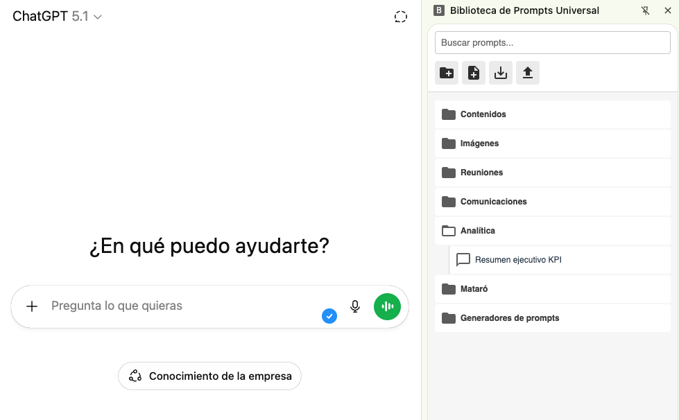
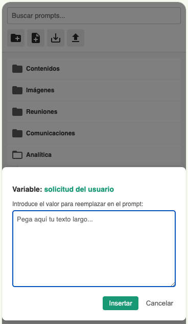

# Universal Prompt Library 🚀

A powerful, local-first Chrome Extension to manage, organize, and inject prompts into any AI chatbot (ChatGPT, Claude, Gemini, DeepSeek, and more).

## 🌟 Features

* **📂 Unlimited Folders:** Organize your prompts in a nested folder structure without limits.
* **🖱️ Smart Drag & Drop:** Reorder prompts, move them between folders, and organize your library intuitively.
* **🧩 Dynamic Variables:** Use placeholders like `{{Topic}}` or `{{Tone}}` in your prompts. The extension will ask for input via a custom modal before injecting.
* **💉 Universal Injection:** Works on **any** website. Automatically detects chat inputs in ChatGPT, Claude, Gemini, Perplexity, and generic text areas.
* **💾 Local & Private:** All data is stored locally in your browser (`chrome.storage.local`). No external servers, no tracking.
* **📦 Backup System:** Export and Import your library as a JSON file to keep your data safe or share it between devices.

## 🛠️ Installation

Since this extension is currently in **Developer Mode** (not yet in the Chrome Web Store), follow these steps to install it:

1.  **Clone or Download** this repository to a folder on your computer.
2.  Open Google Chrome (or Edge/Brave/Opera).
3.  Go to `chrome://extensions/` in the address bar.
4.  Toggle **"Developer mode"** on in the top right corner.
5.  Click the **"Load unpacked"** button.
6.  Select the folder where you downloaded this repository.
7.  Done! Pin the extension icon to your browser toolbar for easy access.

## 📖 How to Use

### 1. Opening the Library
Click the extension icon in your toolbar. This will open the **Chrome Side Panel** on the right side of your screen.

### 2. Creating & Organizing
* Use the buttons at the top to create a **New Folder** 📂 or a **New Prompt** 📝.
* **Drag and drop** items to reorder them or move them inside folders.
    * *Top of item:* Insert before.
    * *Bottom of item:* Insert after.
    * *Center (Folders only):* Move inside.

### 3. Using Variables
You can create dynamic templates using double curly braces `{{...}}`.

**Example Prompt:**
> "Write a {{Tone}} blog post about {{Topic}} focused on {{Audience}}."

When you click the **Send/Inject** button (paper plane icon), the extension will open a modal asking you to fill in "Tone", "Topic", and "Audience" one by one, and then inject the final text into the AI chat.

### 4. Backup
Use the **Save (Disk)** icon to download a `.json` backup of your library. Use the **Upload** icon to restore it.

## 🤝 Contributing

Contributions are welcome! If you have ideas for improvements:

1.  Fork the repository.
2.  Create a new branch (`git checkout -b feature/AmazingFeature`).
3.  Commit your changes.
4.  Push to the branch.
5.  Open a Pull Request.

## 🛡️ Privacy & Security

* **Offline First:** This extension does not send any data to external servers. Your prompts live in your browser's local storage.
* **Permissions:** The extension requires permissions to access web pages solely to inject text into the chat input fields.

## 📄 License

Distributed under the MIT License. See `LICENSE` for more information.

---
*Created with ❤️ for the AI Community.*
